<div align="center">

# WeBuild — Trading Authority Game

### Le netlinking SEO transformé en jeu de cartes à collectionner.

**Déclarez vos sites. La plateforme les capture, mesure leur autorité, et en génère une carte dont la rareté — Game Boy → Super NES → PlayStation 2 → holographique — reflète leur puissance SEO réelle. Puis vous construisez des liens éditoriaux entre membres.**

Cap nord long terme : le **GEO** *(Generative Engine Optimization)* — être **cité par les IA génératives** (AI Overviews, Perplexity, ChatGPT), pas seulement classé sur Google.

`SEO` · `GEO` · `Generative Engine Optimization` · `link building` · `netlinking` · `trading card game` · `gamification` · `Next.js 15` · `React 19` · `TypeScript` · `React Three Fiber` · `WebGL`

**🇫🇷 Français** · [🇬🇧 English](#english)

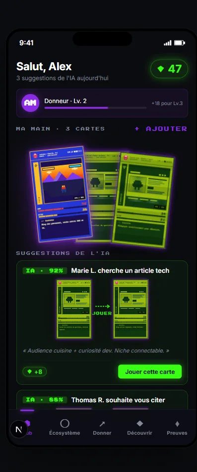

</div>

---

## Sommaire

- [En une phrase](#en-une-phrase)
- [Pourquoi c'est nouveau](#pourquoi-cest-nouveau)
- [La carte : l'autorité rendue visible](#la-carte--lautorité-rendue-visible)
- [Du site réel à la carte réelle (pipeline live)](#du-site-réel-à-la-carte-réelle-pipeline-live)
- [Les écrans du produit](#les-écrans-du-produit)
- [Comment ça marche](#comment-ça-marche)
- [Conformité Google & lignes rouges](#conformité-google--lignes-rouges)
- [La vision : du SEO au GEO](#la-vision--du-seo-au-geo)
- [La stack, tracée](#la-stack-tracée)
- [Architecture du pipeline](#architecture-du-pipeline)
- [Démarrage rapide](#démarrage-rapide)
- [Structure du dépôt](#structure-du-dépôt)
- [Statut & roadmap](#statut--roadmap)

---

## En une phrase

**WeBuild — Trading Authority Game** est une web app qui transforme la construction de liens SEO (*backlink building*) en **jeu de cartes à collectionner (TCG)**. Les membres se connectent avec Google, déclarent leurs sites ; la plateforme **capture et résume** chaque site et génère une **carte** dont la **rareté visuelle est indexée sur l'autorité réelle** du site. Les membres construisent ensuite des liens **éditoriaux** entre eux — sans achat de liens, sans échange réciproque, sans ferme de liens.

> C'est **du link-building éditorial entre propriétaires de sites**, pas une marketplace de liens.

---

## Pourquoi c'est nouveau

Le netlinking est aride, opaque, souvent assimilé à du spam. WeBuild le rend **lisible et motivant** en fusionnant trois mondes que personne n'avait réunis :

1. **le SEO** — déjà un jeu de stratégie en soi ;
2. **les codes du TCG** — rareté, collection, cartes, stats ;
3. **une esthétique qui traverse l'histoire du jeu vidéo** (Game Boy → SNES → PS2 → holographique).

La nouveauté clé : **la rareté visuelle est dérivée de l'autorité réelle** du site — jamais saisie à la main. La carte *est* une lecture instantanée de la puissance SEO. Et la mécanique de jeu **aligne le joueur sur les bonnes pratiques** (liens pertinents nés d'un contenu réel) plutôt que sur la quantité brute.

---

## La carte : l'autorité rendue visible

Chaque site = une carte. Son **niveau (1 à 4)** est dérivé de son autorité et pilote toute son esthétique. Quatre habillages, quatre états visuels — portés en **CSS-first** (foil = `conic-gradient` + `mix-blend-mode`, scanlines, bloom, flip 3D, tilt au pointeur), pour un impact quasi nul sur le bundle produit.


| Niveau | Habillage | Signifie | Effets signature |
|---|---|---|---|
| **1** | 🟩 Game Boy | site/lien de départ | scanlines LCD, 4 verts olive |
| **2** | 🟦 Super NES | autorité moyenne | biseau cartouche, perspective Mode 7 |
| **3** | 🔷 PlayStation 2 | forte autorité | bloom radial, lens flare, orbe 3D |
| **4** | 🌈 Rare holographique | autorité exceptionnelle (médias majeurs) | foil iridescent, glitch doré, particules |

> **HP = trust, ATK = reach.** Les stats sont, elles aussi, dérivées des signaux du site.

---

## Du site réel à la carte réelle (pipeline live)

La route `/capturer` est une **tranche verticale fonctionnelle de bout en bout** : on colle une URL → **Firecrawl** capture la page → **LiteLLM** en extrait le sens (résumé, thématique) → un **score d'autorité** (v1 on-page) en dérive le niveau et les stats → le composant `<Card/>` affiche une **vraie carte**.

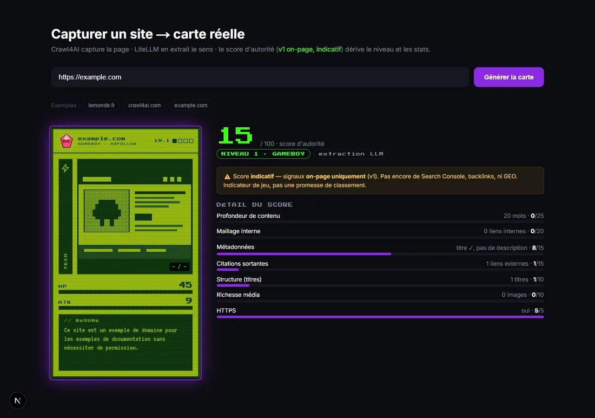

Le score est **transparent et indicatif** : chaque signal (profondeur de contenu, maillage interne, métadonnées, citations sortantes, structure, média, HTTPS) est exposé tel quel. Un bandeau le rappelle sans ambiguïté :

> ⚠️ *Score indicatif — signaux on-page uniquement (v1). Pas encore de Search Console, backlinks, ni GEO. **Indicateur de jeu, pas une promesse de classement.***

---

## Les écrans du produit

Interface mobile-first (390×844), univers rétro-gaming, accent violet néon = l'action ; vert cyber = les crédits et la validation.

### 🗺️ Écosystème — la carte du monde des alliés

Les sites alliés disposés en **biomes thématiques** (Tech, Presse, Finance, Cuisine, Encyclo) façon RPG. Taper un nœud ouvre une carte cible et son CTA « Donner depuis votre main ».

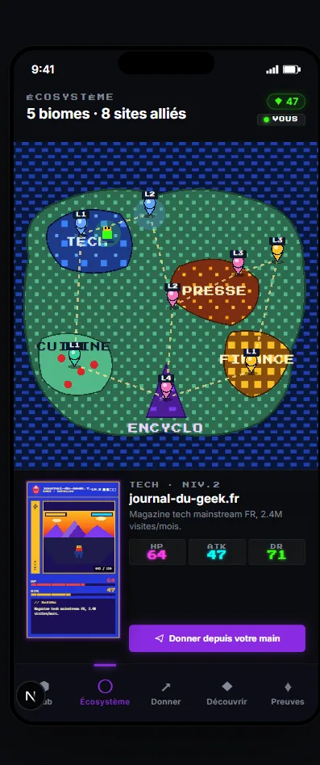

### ↗️ Donner un lien — un flux IA en 4 étapes

L'IA assiste à chaque étape, **l'humain valide toujours**. De gauche à droite : choisir une carte de sa main (Fit IA + gain estimé) → choisir un territoire → **l'IA propose l'article** (sujet + paragraphe avec l'ancre éditable surlignée) → publier et déclencher la capture-preuve.

| 1 · Choisir sa carte | 3 · L'IA propose l'article |
|---|---|
| 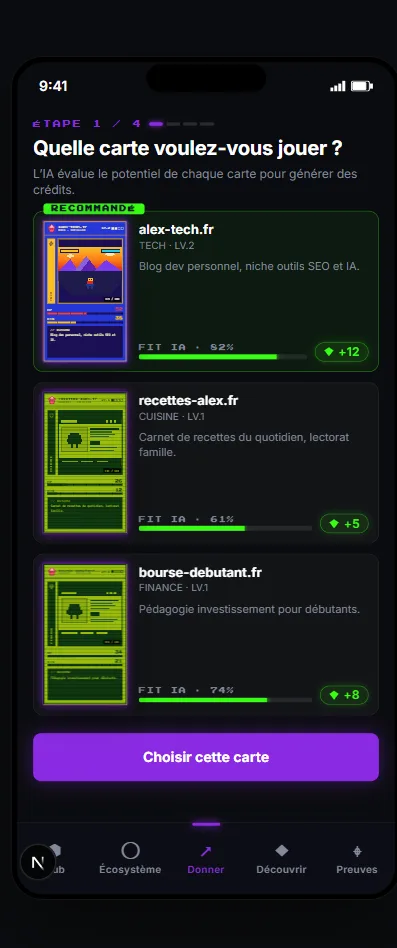 | 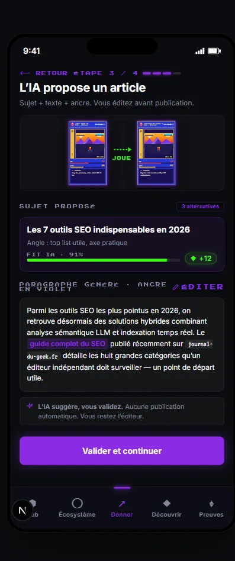 |

> *« L'IA suggère, vous validez. Aucune publication automatique. »* — la règle est dans l'UI.

### ◆ Être découvert — « brandir l'étendard »

On **dépense des crédits** pour que l'IA propose une de ses cartes à des éditeurs alignés. Slider de budget, estimations IA (éditeurs ciblés, suggestions, délai), filtres de niche — et le rappel de la ligne rouge en clair.

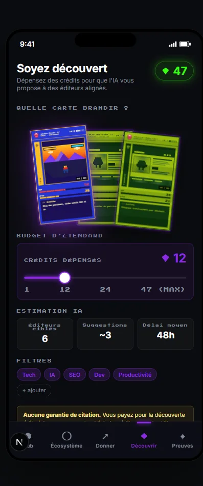

> *« Aucune garantie de citation. Vous payez pour la découverte éditoriale, pas pour un backlink. »*

### ⌖ Sceaux de preuve — le contrat moral

Quand un lien est publié, la plateforme **capture la page** pour prouver qu'il existe réellement (capture + détection du lien). C'est ce qui **crédite le don** et entretient la confiance du réseau. Le détail montre la capture avec l'ancre détectée surlignée et la timeline de vérification.

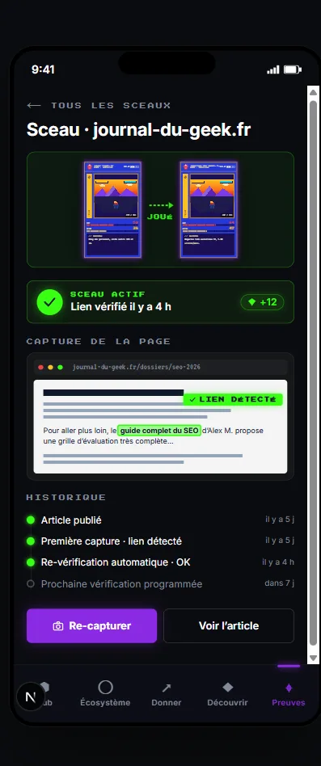

### ✨ Transitions chorégraphiées & hero 3D

5 transitions clés (vol de carte, sceau de cire, pluie de crédits, onboarding…) en `motion`, et des **moments hero en WebGL** réservés aux R&D routes : un château de cartes en **physique temps réel** (Rapier) et des cartes holographiques 3D à **foil Fresnel** — isolés du bundle produit via `dynamic(ssr:false)`.

| Transitions chorégraphiées | Cartes 3D holographiques (R3F) |
|---|---|
| 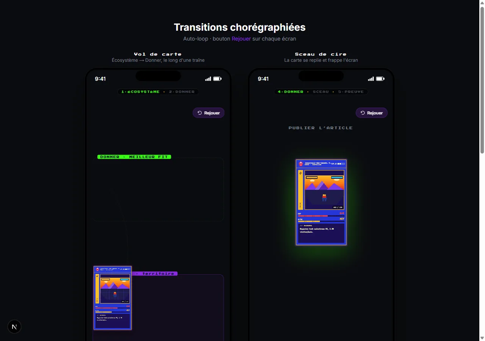 | 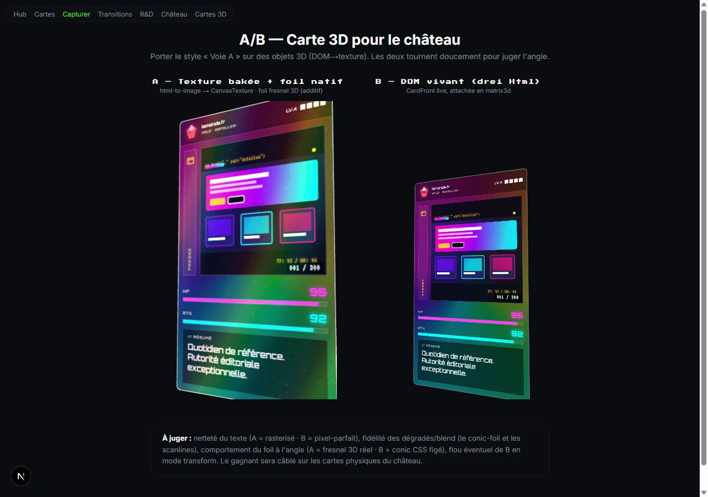 |

---

## Comment ça marche

```
Connexion Google → Déclaration des URLs → Capture + résumé automatiques
   → Carte (autorité → niveau / stats / image) → Matching éditorial (IA)
      → Don de lien (IA propose, humain valide) → Sceau de preuve → Crédits
```

- **Mécanique donateur (pas de troc).** Tu **donnes** un lien éditorial pertinent vers un autre membre → tu **gagnes des crédits**. Tu **dépenses** tes crédits pour être mis en avant auprès d'éditeurs susceptibles de te citer. Le flux est **unilatéral** : celui à qui tu donnes n'est pas celui qui te cite.
- **Les crédits** (symbole `◆`) sont la monnaie du jeu. Ils **découplent le don de la réception** — c'est ce qui rend le réseau naturel, sans réciprocité forcée.
- **L'image de la carte** = import utilisateur (ou auto-dérivée du site), retravaillée par un **filtre déterministe par niveau** (gratuit) ou un **remaster génératif** (opt-in) — toujours finie par le filtre du niveau, garant de la cohérence de l'univers.
- **Connecter sa Google Search Console** (optionnel, recommandé) donne la vraie donnée Google pour une autorité plus juste **et prouve la propriété du site**.

---

## Conformité Google & lignes rouges

Le produit est conçu pour **s'aligner sur ce que Google récompense** — des liens éditoriaux, pertinents, nés d'un contenu réel — et **éviter les patterns qu'il pénalise**. Cinq lignes rouges, jamais violées :

1. **Aucune promesse de jus de lien** — jamais de « dofollow garanti », jamais de « DA boosté ».
2. **Pas d'échange réciproque 1:1 ni de chaîne A→B→C scellée** — ce sont précisément les schémas que Google traque (liens réciproques, *link wheels*). Le modèle donateur les évite **par construction**.
3. **L'IA suggère, l'humain valide TOUJOURS** — aucune publication automatique.
4. **La rareté / le niveau sont dérivés**, jamais saisis à la main.
5. **La preuve = la capture** — pas de déclaration sur l'honneur.

> L'**anti-empreinte** est une exigence de conception, pas une option : diversité d'ancres, dédup sémantique, anti-cycle de graphe, « score de naturalité ». Industrialiser des suggestions sans ça recréerait l'exacte empreinte de réseau que Google détecte.

---

## La vision : du SEO au GEO

La recherche se transforme : de plus en plus de réponses viennent d'**IA génératives** qui **citent des sources** plutôt que d'afficher dix liens bleus. Être visible demain, c'est être **cité par ces moteurs** — c'est le **GEO** *(Generative Engine Optimization)*.

WeBuild est taillé pour ça : le GEO récompense exactement ce qu'on construit — des **mentions pertinentes et répétées** d'une marque, dans du **contenu éditorial de qualité**, sur des **sujets cohérents**. Là où le SEO classique courait après le lien dofollow, le GEO valorise la **mention et la citation**, ce qui rend l'approche éditoriale *naturellement alignée*.

> **Le SEO ne meurt pas, il converge.** On parle de **convergence SEO → GEO** : on élargit la surface de visibilité, on ne parie pas sur la disparition de l'un au profit de l'autre. Les *hard problems* restent la **métrique d'autorité** et l'**attribution** (prouver les citations LLM).

---

## La stack, tracée

> **Statut : POC front-end** (foundation Next.js 15). L'UI hi-fi et le rendu des cartes sont la priorité ; le pipeline IA + tracing complets sont **branchés progressivement** sur l'infra partagée `augmenter.pro`.

### ✅ Implémenté dans ce dépôt

| Couche | Choix | Détail |
|---|---|---|
| **Framework** | **Next.js 15** (App Router) + **React 19** + **TypeScript** | build Turbopack, `reactStrictMode` |
| **Styling** | **tokens.css + CSS Modules** (pas de Tailwind) | design tokens portés du handoff hi-fi |
| **Fonts** | `next/font` — Inter, Orbitron, Press Start 2P, VT323 | self-host, `display: swap` |
| **Animations / état** | **`motion`** (transitions) + **`zustand`** (game state) | — |
| **Rendu carte** | **CSS-first** (foil `conic-gradient`, scanlines, flip `rotateY`, tilt pointeur) | bundle ~0, GPU léger |
| **3D / hero** | **React Three Fiber** + drei + **Rapier** (physique) + leva + r3f-perf + html-to-image | **isolé aux R&D routes** via `dynamic(ssr:false)` — hors bundle produit |
| **Capture web** | `lib/services` — **Firecrawl** v3 (moteur unique de crawl, rendu JS), via `captureSite()` | garde **SSRF** (refus IP privées/loopback), retry + backoff |
| **LLM** | `lib/services/litellm.ts` — passerelle **LiteLLM** (`chat` / `chatJson`) | fallback si clé absente |
| **Autorité** | `lib/authority/score.ts` — score composite **pur**, v1 on-page, transparent | recalibrage = éditer poids + bandes |
| **Tests** | **Vitest** — `scrape` (succès/erreurs/retry) + garde SSRF, `fetch`/DNS mockés | `npm test` |

### 🎯 Cible (réutilise l'infra `augmenter.pro`, déployée via Coolify)

- **Auth** : Better Auth + Google OAuth
- **Async** : Celery + Redis (workers *tiered* : triage → tier 1/2/3)
- **Datastore** : PostgreSQL 16 + **pgvector** (1536d) via Prisma ; matching sémantique = embed → recherche pgvector → rerank cross-encoder
- **Modèles LiteLLM** (alias sémantiques) : `fast4b` (extraction), `groq-fast` (scoring), `gemma4-vision` (multimodal), `groq-qwen3-32b` (génération FR), `gte-qwen2-local` (embeddings)
- **Image générative** : ComfyUI (remaster opt-in) ; modération `gemma4-vision`
- **Observabilité** : Langfuse (traces LLM), Flower (Celery), Bull Board (BullMQ)

---

## Architecture du pipeline

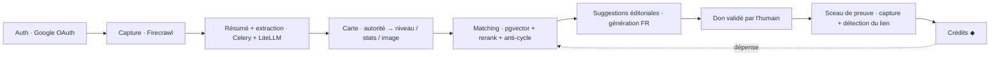

---

## Démarrage rapide

```bash
# 1. Installer
npm install

# 2. Lancer le dev (Turbopack)
npm run dev          # http://localhost:3000

# 3. Vérifier / tester
npm run lint
npm test             # Vitest (aucun appel réseau réel : fetch + DNS mockés)

# 4. Build de prod
npm run build && npm run start
```

Pour activer la **capture réelle** sur `/capturer`, copier `.env.local.example` → `.env.local` et renseigner `FIRECRAWL_API_URL` et `LITELLM_API_KEY`. Firecrawl est interne (WireGuard) : en dev local, ouvrir un tunnel `ssh -N -L 3002:10.10.0.1:3002 coolify` puis pointer `FIRECRAWL_API_URL=http://localhost:3002`. Sans clé LiteLLM, l'extraction bascule sur un fallback déterministe ; sans Firecrawl joignable, la capture échoue (aucun fallback de crawl).

### Routes

| Route | Écran |
|---|---|
| `/` | Hub — tableau de bord (solde, main, suggestions IA, activité) |
| `/ecosysteme` | Carte du monde des sites alliés (biomes) |
| `/donner` | Donner un lien — flux IA en 4 étapes |
| `/decouvrir` | Être découvert — brandir l'étendard |
| `/preuves` | Sceaux de preuve (liste + détail) |
| `/capturer` | **Tranche verticale réelle** : URL → carte |
| `/cards` | Showcase du gabarit carte (4 niveaux × 4 états) |
| `/transitions` | Transitions chorégraphiées (auto-loop + Replay) |
| `/rnd`, `/chateau`, `/chateau-cartes` | R&D 3D (R3F / Rapier / shaders) — hors bundle produit |

---

## Structure du dépôt

```
app/
├── components/
│   ├── card/        # gabarit carte CSS-first (Card, Front/Back, SiteShot, tilt)
│   ├── hub/         # écrans plateforme (Hub, Écosystème, Donner, Découvrir, Preuves)
│   ├── r3f/         # 3D isolée : château physique, holo foil, DOM→texture bake
│   └── transitions/ # transitions chorégraphiées
├── (routes)/        # /, /ecosysteme, /donner, /decouvrir, /preuves, /capturer…
└── styles/tokens.css
lib/
├── services/        # capture (Firecrawl), garde SSRF, LiteLLM
├── authority/       # score d'autorité (pur) + extraction LLM
├── domain/          # entités & mapping carte
├── levels/          # niveaux 1–4
└── data/            # fixtures + catalogue mock Pokémon ([docs/mock-catalogue.md](docs/mock-catalogue.md))
docs/                # doctrine produit (FR) — source de vérité
└── assets/         # captures utilisées dans ce README
```

📚 **Doctrine produit** (français, source de vérité) :
[FAQ](docs/faq.md) · [gameplay & technique](docs/draft-gameplay-technique.md) · [vision GEO](docs/draft-vision-geo.md) · [métrique d'autorité](docs/draft-metrique-autorite.md) · [pipeline IA](docs/draft-pipeline-ia.md) · [charte graphique](docs/draft-charte-graphique.md) · [notes 3D / R3F](docs/draft-rendu-3d.md)

---

## Statut & roadmap

POC front-end **fonctionnel** (UI hi-fi + capture→carte de bout en bout). Points encore **ouverts** (non « vérité » tant que non tranchés) :

- 🚧 **Calibrage de la métrique d'autorité** — poids SEO/GEO, seuils de niveaux, anti-fraude (architecture actée : Authority Score = SEO hybride dont Search Console + GEO proxy/Sonar).
- 🚧 **Calibrage des crédits** — la forme est actée (monnaie conservative, gain amorti, clawback) ; restent les chiffres (BASE, seuils, plafonds).
- 🚧 **Réglages d'image** — recettes de filtres par niveau + LoRA génératifs.
- 🚧 **Contrat moral** — fréquence de re-capture, détection de triche (cloaking, lien JS, nofollow caché).
- 🚧 **Progression / méta-jeu** — collection, montée en puissance, quêtes.

---

<div align="center">

*WeBuild — Trading Authority Game.* Construis ton autorité **proprement et durablement**.
Le SEO comme un jeu ; la visibilité comme une collection ; le GEO comme horizon.

</div>

---
---

<a id="english"></a>

<div align="center">

# 🇬🇧 English

### SEO link building, turned into a collectible trading card game.

**Declare your websites. The platform captures them, measures their authority, and generates a card whose rarity — Game Boy → Super NES → PlayStation 2 → holographic — reflects their real SEO strength. Then you build editorial links between members.**

Long-term north star: **GEO** *(Generative Engine Optimization)* — being **cited by generative AI** (AI Overviews, Perplexity, ChatGPT), not just ranked on Google.

`SEO` · `GEO` · `Generative Engine Optimization` · `link building` · `backlinks` · `trading card game` · `gamification` · `Next.js 15` · `React 19` · `TypeScript` · `React Three Fiber` · `WebGL`

[🇫🇷 Français](#webuild--trading-authority-game) · **🇬🇧 English**


</div>

---

## Contents

- [In one sentence](#in-one-sentence)
- [Why it's new](#why-its-new)
- [The card: authority made visible](#the-card-authority-made-visible)
- [From real site to real card (live pipeline)](#from-real-site-to-real-card-live-pipeline)
- [The product screens](#the-product-screens)
- [How it works](#how-it-works)
- [Google compliance & red lines](#google-compliance--red-lines)
- [The vision: from SEO to GEO](#the-vision-from-seo-to-geo)
- [The stack, traced](#the-stack-traced)
- [Pipeline architecture](#pipeline-architecture)
- [Quick start](#quick-start)
- [Repository structure](#repository-structure)
- [Status & roadmap](#status--roadmap)

---

## In one sentence

**WeBuild — Trading Authority Game** is a web app that turns SEO link building (*backlink building*) into a **collectible trading card game (TCG)**. Members sign in with Google, declare their websites; the platform **captures and summarizes** each site and generates a **card** whose **visual rarity is indexed to the site's real authority**. Members then build **editorial** links with each other — no link buying, no reciprocal swaps, no link farms.

> It's **editorial link building between site owners**, not a link marketplace.

---

## Why it's new

Link building is dry, opaque, and often equated with spam. WeBuild makes it **legible and motivating** by fusing three worlds nobody had brought together:

1. **SEO** — already a strategy game in itself;
2. **the codes of the TCG** — rarity, collection, cards, stats;
3. **an aesthetic that travels through gaming history** (Game Boy → SNES → PS2 → holographic).

The key novelty: **visual rarity is derived from the site's real authority** — never hand-entered. The card *is* an instant read of SEO strength. And the game mechanic **aligns the player with best practices** (relevant links born from real content) rather than raw quantity.

---

## The card: authority made visible

Each site = one card. Its **level (1 to 4)** is derived from its authority and drives its entire aesthetic. Four skins, four visual states — built **CSS-first** (foil = `conic-gradient` + `mix-blend-mode`, scanlines, bloom, 3D flip, pointer tilt), for near-zero impact on the product bundle.


| Level | Skin | Means | Signature effects |
|---|---|---|---|
| **1** | 🟩 Game Boy | starter site/link | LCD scanlines, 4 olive greens |
| **2** | 🟦 Super NES | average authority | cartridge bevel, Mode 7 perspective |
| **3** | 🔷 PlayStation 2 | strong authority | radial bloom, lens flare, 3D orb |
| **4** | 🌈 Holographic rare | exceptional authority (major media) | iridescent foil, golden glitch, particles |

> **HP = trust, ATK = reach.** Stats, too, are derived from the site's signals.

---

## From real site to real card (live pipeline)

The `/capturer` route is a **working end-to-end vertical slice**: paste a URL → **Firecrawl** captures the page → **LiteLLM** extracts the meaning (summary, topic) → an **authority score** (v1, on-page) derives the level and stats → the `<Card/>` component renders a **real card**.


The score is **transparent and indicative**: every signal (content depth, internal linking, metadata, outbound citations, structure, media, HTTPS) is exposed as-is. A banner states it without ambiguity:

> ⚠️ *Indicative score — on-page signals only (v1). No Search Console, backlinks, or GEO yet. **A game indicator, not a ranking promise.***

---

## The product screens

Mobile-first interface (390×844), retro-gaming universe, neon-purple accent = the action; cyber-green = credits and validation.

### 🗺️ Ecosystem — the world map of allies

Allied sites laid out in **thematic biomes** (Tech, Press, Finance, Cooking, Encyclopedia), RPG-style. Tapping a node opens a target card and its "Donate from your hand" CTA.


### ↗️ Donate a link — a 4-step AI flow

The AI assists at every step, **the human always validates**. Left to right: pick a card from your hand (AI Fit + estimated gain) → pick a territory → **the AI proposes the article** (topic + paragraph with the editable anchor highlighted) → publish and trigger the proof capture.

| 1 · Pick your card | 3 · The AI proposes the article |
|---|---|
|  |  |

> *"The AI suggests, you validate. No automatic publishing."* — the rule is in the UI.

### ◆ Get discovered — "raise the banner"

You **spend credits** so the AI proposes one of your cards to aligned editors. Budget slider, AI estimates (targeted editors, suggestions, lead time), niche filters — and the red line spelled out in plain sight.


> *"No citation guarantee. You pay for editorial discovery, not for a backlink."*

### ⌖ Proof seals — the moral contract

When a link is published, the platform **captures the page** to prove it really exists (screenshot + link detection). This is what **credits the donation** and keeps the network's trust. The detail view shows the capture with the detected anchor highlighted and the verification timeline.


### ✨ Choreographed transitions & 3D hero

5 key transitions (card flight, wax seal, credit rain, onboarding…) built with `motion`, plus **WebGL hero moments** reserved for R&D routes: a house of cards with **real-time physics** (Rapier) and 3D holographic cards with a **Fresnel foil** — isolated from the product bundle via `dynamic(ssr:false)`.

| Choreographed transitions | 3D holographic cards (R3F) |
|---|---|
|  |  |

---

## How it works

```
Google sign-in → Declare your URLs → Automatic capture + summary
   → Card (authority → level / stats / image) → Editorial matching (AI)
      → Link donation (AI proposes, human validates) → Proof seal → Credits
```

- **Donor mechanic (no bartering).** You **donate** a relevant editorial link to another member → you **earn credits**. You **spend** credits to be promoted to editors likely to cite you. The flow is **one-directional**: the one you donate to is not the one who cites you.
- **Credits** (symbol `◆`) are the game currency. They **decouple donating from receiving** — that's what keeps the network natural, with no forced reciprocity.
- **The card image** = user upload (or auto-derived from the site), reprocessed by a **deterministic per-level filter** (free) or a **generative remaster** (opt-in) — always finished by the level filter, the guarantor of universe consistency.
- **Connecting your Google Search Console** (optional, recommended) provides Google's real data for a fairer authority score **and proves site ownership**.

---

## Google compliance & red lines

The product is designed to **align with what Google rewards** — editorial, relevant links born from real content — and to **avoid the patterns it penalizes**. Five red lines, never crossed:

1. **No link-juice promises** — never "guaranteed dofollow", never "DA boost".
2. **No 1:1 reciprocal swaps or sealed A→B→C chains** — these are precisely the schemes Google tracks (reciprocal links, *link wheels*). The donor model avoids them **by construction**.
3. **The AI suggests, the human ALWAYS validates** — no automatic publishing.
4. **Rarity / level are derived**, never hand-entered.
5. **Proof = the capture** — no honor-system declarations.

> **Anti-footprint** is a design requirement, not an option: anchor diversity, semantic dedup, graph anti-cycle, a "naturalness score". Industrializing suggestions without it would recreate the exact network footprint Google detects.

---

## The vision: from SEO to GEO

Search is changing: more and more answers come from **generative AI** that **cites sources** rather than showing ten blue links. Being visible tomorrow means being **cited by these engines** — that's **GEO** *(Generative Engine Optimization)*.

WeBuild is built for that: GEO rewards exactly what we build — **relevant, repeated mentions** of a brand, in **quality editorial content**, on **coherent topics**. Where classic SEO chased the dofollow link, GEO values the **mention and the citation**, which makes the editorial approach *naturally aligned*.

> **SEO isn't dying, it's converging.** We talk about **SEO → GEO convergence**: we widen the visibility surface, we don't bet on one disappearing for the other. The hard problems remain the **authority metric** and **attribution** (proving LLM citations).

---

## The stack, traced

> **Status: front-end POC** (Next.js 15 foundation). The hi-fi UI and card rendering are the priority; the full AI pipeline + tracing are **wired in progressively** on the shared `augmenter.pro` infra.

### ✅ Implemented in this repository

| Layer | Choice | Detail |
|---|---|---|
| **Framework** | **Next.js 15** (App Router) + **React 19** + **TypeScript** | Turbopack build, `reactStrictMode` |
| **Styling** | **tokens.css + CSS Modules** (no Tailwind) | design tokens ported from the hi-fi handoff |
| **Fonts** | `next/font` — Inter, Orbitron, Press Start 2P, VT323 | self-hosted, `display: swap` |
| **Animation / state** | **`motion`** (transitions) + **`zustand`** (game state) | — |
| **Card rendering** | **CSS-first** (foil `conic-gradient`, scanlines, `rotateY` flip, pointer tilt) | ~0 bundle, light GPU |
| **3D / hero** | **React Three Fiber** + drei + **Rapier** (physics) + leva + r3f-perf + html-to-image | **isolated to R&D routes** via `dynamic(ssr:false)` — out of the product bundle |
| **Web capture** | `lib/services` — **Firecrawl** v3 (sole crawl engine, JS rendering), via `captureSite()` | **SSRF** guard (rejects private/loopback IPs), retry + backoff |
| **LLM** | `lib/services/litellm.ts` — **LiteLLM** gateway (`chat` / `chatJson`) | fallback if no key |
| **Authority** | `lib/authority/score.ts` — **pure** composite score, v1 on-page, transparent | recalibrate = edit weights + bands |
| **Tests** | **Vitest** — `scrape` (success/errors/retry) + SSRF guard, `fetch`/DNS mocked | `npm test` |

### 🎯 Target (reuses the `augmenter.pro` infra, deployed via Coolify)

- **Auth**: Better Auth + Google OAuth
- **Async**: Celery + Redis (tiered workers: triage → tier 1/2/3)
- **Datastore**: PostgreSQL 16 + **pgvector** (1536d) via Prisma; semantic matching = embed → pgvector search → cross-encoder rerank
- **LiteLLM models** (semantic aliases): `fast4b` (extraction), `groq-fast` (scoring), `gemma4-vision` (multimodal), `groq-qwen3-32b` (FR generation), `gte-qwen2-local` (embeddings)
- **Generative image**: ComfyUI (opt-in remaster); moderation via `gemma4-vision`
- **Observability**: Langfuse (LLM traces), Flower (Celery), Bull Board (BullMQ)

---

## Pipeline architecture

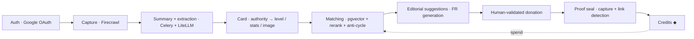

---

## Quick start

```bash
# 1. Install
npm install

# 2. Run dev (Turbopack)
npm run dev          # http://localhost:3000

# 3. Lint / test
npm run lint
npm test             # Vitest (no real network calls: fetch + DNS mocked)

# 4. Production build
npm run build && npm run start
```

To enable **real capture** on `/capturer`, copy `.env.local.example` → `.env.local` and fill in `FIRECRAWL_API_URL` and `LITELLM_API_KEY`. Firecrawl is internal (WireGuard): for local dev, open a tunnel `ssh -N -L 3002:10.10.0.1:3002 coolify` then set `FIRECRAWL_API_URL=http://localhost:3002`. Without a LiteLLM key, extraction falls back gracefully; without a reachable Firecrawl, capture fails (no crawl fallback).

### Routes

| Route | Screen |
|---|---|
| `/` | Hub — dashboard (balance, hand, AI suggestions, activity) |
| `/ecosysteme` | World map of allied sites (biomes) |
| `/donner` | Donate a link — 4-step AI flow |
| `/decouvrir` | Get discovered — raise the banner |
| `/preuves` | Proof seals (list + detail) |
| `/capturer` | **Real vertical slice**: URL → card |
| `/cards` | Card template showcase (4 levels × 4 states) |
| `/transitions` | Choreographed transitions (auto-loop + Replay) |
| `/rnd`, `/chateau`, `/chateau-cartes` | 3D R&D (R3F / Rapier / shaders) — out of the product bundle |

---

## Repository structure

```
app/
├── components/
│   ├── card/        # CSS-first card template (Card, Front/Back, SiteShot, tilt)
│   ├── hub/         # platform screens (Hub, Ecosystem, Donate, Discover, Proofs)
│   ├── r3f/         # isolated 3D: physics castle, holo foil, DOM→texture bake
│   └── transitions/ # choreographed transitions
├── (routes)/        # /, /ecosysteme, /donner, /decouvrir, /preuves, /capturer…
└── styles/tokens.css
lib/
├── services/        # capture (Firecrawl), SSRF guard, LiteLLM
├── authority/       # authority score (pure) + LLM extraction
├── domain/          # entities & card mapping
├── levels/          # levels 1–4
└── data/            # demo fixtures
docs/                # product doctrine (FR) — source of truth
└── assets/          # screenshots used in this README
```

📚 **Product doctrine** (French, source of truth):
[FAQ](docs/faq.md) · [gameplay & technical](docs/draft-gameplay-technique.md) · [GEO vision](docs/draft-vision-geo.md) · [authority metric](docs/draft-metrique-autorite.md) · [AI pipeline](docs/draft-pipeline-ia.md) · [design system](docs/draft-charte-graphique.md) · [3D / R3F notes](docs/draft-rendu-3d.md)

---

## Status & roadmap

A **working** front-end POC (hi-fi UI + end-to-end capture→card). Still **open** items (not "truth" until decided):

- 🚧 **Authority metric calibration** — SEO/GEO weights, level thresholds, anti-fraud (architecture locked: Authority Score = hybrid SEO incl. Search Console + GEO proxy/Sonar).
- 🚧 **Credits calibration** — the form is locked (conservative currency, amortized gain, clawback); the numbers remain (BASE, thresholds, caps).
- 🚧 **Image settings** — per-level filter recipes + generative LoRAs.
- 🚧 **Moral contract** — re-capture frequency, cheating detection (cloaking, JS links, hidden nofollow).
- 🚧 **Progression / meta-game** — collection, power growth, quests.

---

<div align="center">

*WeBuild — Trading Authority Game.* Build your authority **cleanly and durably**.
SEO as a game; visibility as a collection; GEO as the horizon.

</div>
