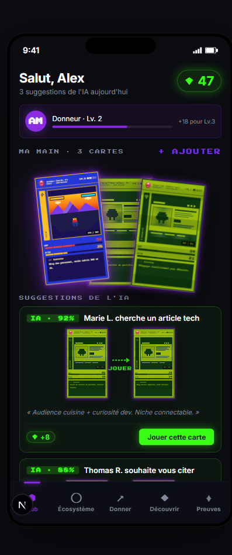
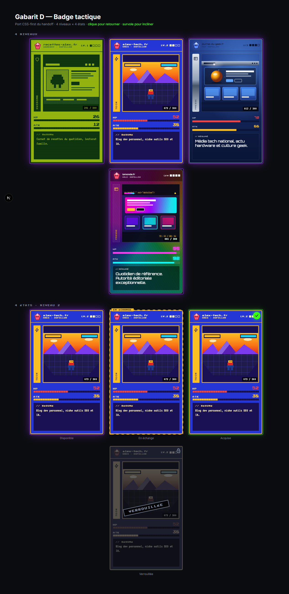
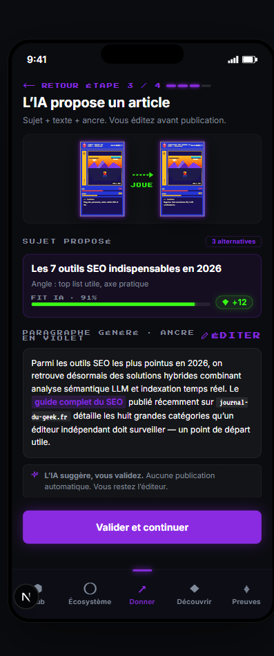
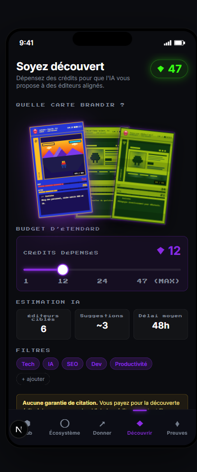
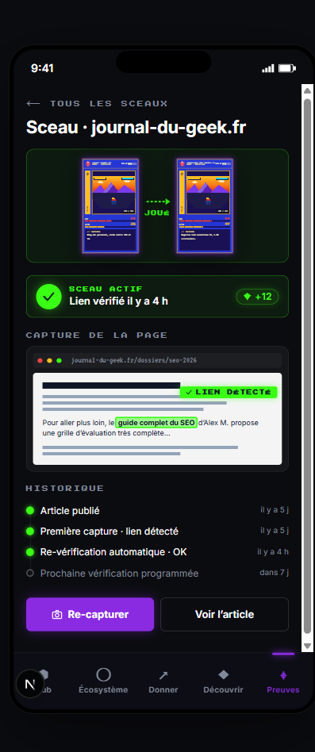
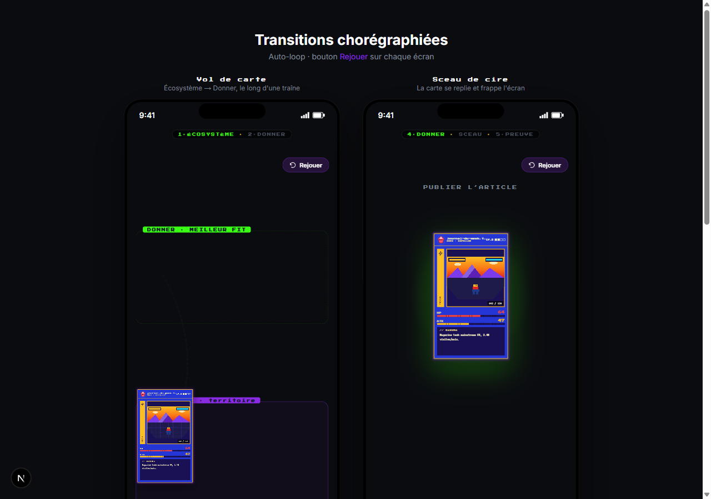
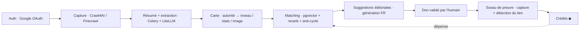

<div align="center">

# WeBuild — Trading Authority Game

### Le netlinking SEO transformé en jeu de cartes à collectionner.

**Déclarez vos sites. La plateforme les capture, mesure leur autorité, et en génère une carte dont la rareté — Game Boy → Super NES → PlayStation 2 → holographique — reflète leur puissance SEO réelle. Puis vous construisez des liens éditoriaux entre membres.**

Cap nord long terme : le **GEO** *(Generative Engine Optimization)* — être **cité par les IA génératives** (AI Overviews, Perplexity, ChatGPT), pas seulement classé sur Google.

`SEO` · `GEO` · `Generative Engine Optimization` · `link building` · `netlinking` · `trading card game` · `gamification` · `Next.js 15` · `React 19` · `TypeScript` · `React Three Fiber` · `WebGL`



</div>

---

## Sommaire

- [En une phrase](#en-une-phrase)
- [Pourquoi c'est nouveau](#pourquoi-cest-nouveau)
- [La carte : l'autorité rendue visible](#la-carte--lautorité-rendue-visible)
- [Du site réel à la carte réelle (pipeline live)](#du-site-réel-à-la-carte-réelle-pipeline-live)
- [Les écrans du produit](#les-écrans-du-produit)
- [Comment ça marche](#comment-ça-marche)
- [Conformité Google & lignes rouges](#conformité-google--lignes-rouges)
- [La vision : du SEO au GEO](#la-vision--du-seo-au-geo)
- [La stack, tracée](#la-stack-tracée)
- [Architecture du pipeline](#architecture-du-pipeline)
- [Démarrage rapide](#démarrage-rapide)
- [Structure du dépôt](#structure-du-dépôt)
- [Statut & roadmap](#statut--roadmap)

---

## En une phrase

**WeBuild — Trading Authority Game** est une web app qui transforme la construction de liens SEO (*backlink building*) en **jeu de cartes à collectionner (TCG)**. Les membres se connectent avec Google, déclarent leurs sites ; la plateforme **capture et résume** chaque site et génère une **carte** dont la **rareté visuelle est indexée sur l'autorité réelle** du site. Les membres construisent ensuite des liens **éditoriaux** entre eux — sans achat de liens, sans échange réciproque, sans ferme de liens.

> C'est **du link-building éditorial entre propriétaires de sites**, pas une marketplace de liens.

---

## Pourquoi c'est nouveau

Le netlinking est aride, opaque, souvent assimilé à du spam. WeBuild le rend **lisible et motivant** en fusionnant trois mondes que personne n'avait réunis :

1. **le SEO** — déjà un jeu de stratégie en soi ;
2. **les codes du TCG** — rareté, collection, cartes, stats ;
3. **une esthétique qui traverse l'histoire du jeu vidéo** (Game Boy → SNES → PS2 → holographique).

La nouveauté clé : **la rareté visuelle est dérivée de l'autorité réelle** du site — jamais saisie à la main. La carte *est* une lecture instantanée de la puissance SEO. Et la mécanique de jeu **aligne le joueur sur les bonnes pratiques** (liens pertinents nés d'un contenu réel) plutôt que sur la quantité brute.

---

## La carte : l'autorité rendue visible

Chaque site = une carte. Son **niveau (1 à 4)** est dérivé de son autorité et pilote toute son esthétique. Quatre habillages, quatre états visuels — portés en **CSS-first** (foil = `conic-gradient` + `mix-blend-mode`, scanlines, bloom, flip 3D, tilt au pointeur), pour un impact quasi nul sur le bundle produit.



| Niveau | Habillage | Signifie | Effets signature |
|---|---|---|---|
| **1** | 🟩 Game Boy | site/lien de départ | scanlines LCD, 4 verts olive |
| **2** | 🟦 Super NES | autorité moyenne | biseau cartouche, perspective Mode 7 |
| **3** | 🔷 PlayStation 2 | forte autorité | bloom radial, lens flare, orbe 3D |
| **4** | 🌈 Rare holographique | autorité exceptionnelle (médias majeurs) | foil iridescent, glitch doré, particules |

> **HP = trust, ATK = reach.** Les stats sont, elles aussi, dérivées des signaux du site.

---

## Du site réel à la carte réelle (pipeline live)

La route `/capturer` est une **tranche verticale fonctionnelle de bout en bout** : on colle une URL → **Crawl4AI** capture la page → **LiteLLM** en extrait le sens (résumé, thématique) → un **score d'autorité** (v1 on-page) en dérive le niveau et les stats → le composant `<Card/>` affiche une **vraie carte**.


Le score est **transparent et indicatif** : chaque signal (profondeur de contenu, maillage interne, métadonnées, citations sortantes, structure, média, HTTPS) est exposé tel quel. Un bandeau le rappelle sans ambiguïté :

> ⚠️ *Score indicatif — signaux on-page uniquement (v1). Pas encore de Search Console, backlinks, ni GEO. **Indicateur de jeu, pas une promesse de classement.***

---

## Les écrans du produit

Interface mobile-first (390×844), univers rétro-gaming, accent violet néon = l'action ; vert cyber = les crédits et la validation.

### 🗺️ Écosystème — la carte du monde des alliés

Les sites alliés disposés en **biomes thématiques** (Tech, Presse, Finance, Cuisine, Encyclo) façon RPG. Taper un nœud ouvre une carte cible et son CTA « Donner depuis votre main ».


### ↗️ Donner un lien — un flux IA en 4 étapes

L'IA assiste à chaque étape, **l'humain valide toujours**. De gauche à droite : choisir une carte de sa main (Fit IA + gain estimé) → choisir un territoire → **l'IA propose l'article** (sujet + paragraphe avec l'ancre éditable surlignée) → publier et déclencher la capture-preuve.

| 1 · Choisir sa carte | 3 · L'IA propose l'article |
|---|---|
|  |  |

> *« L'IA suggère, vous validez. Aucune publication automatique. »* — la règle est dans l'UI.

### ◆ Être découvert — « brandir l'étendard »

On **dépense des crédits** pour que l'IA propose une de ses cartes à des éditeurs alignés. Slider de budget, estimations IA (éditeurs ciblés, suggestions, délai), filtres de niche — et le rappel de la ligne rouge en clair.



> *« Aucune garantie de citation. Vous payez pour la découverte éditoriale, pas pour un backlink. »*

### ⌖ Sceaux de preuve — le contrat moral

Quand un lien est publié, la plateforme **capture la page** pour prouver qu'il existe réellement (capture + détection du lien). C'est ce qui **crédite le don** et entretient la confiance du réseau. Le détail montre la capture avec l'ancre détectée surlignée et la timeline de vérification.



### ✨ Transitions chorégraphiées & hero 3D

5 transitions clés (vol de carte, sceau de cire, pluie de crédits, onboarding…) en `motion`, et des **moments hero en WebGL** réservés aux R&D routes : un château de cartes en **physique temps réel** (Rapier) et des cartes holographiques 3D à **foil Fresnel** — isolés du bundle produit via `dynamic(ssr:false)`.

| Transitions chorégraphiées | Cartes 3D holographiques (R3F) |
|---|---|
|  |  |

---

## Comment ça marche

```
Connexion Google → Déclaration des URLs → Capture + résumé automatiques
   → Carte (autorité → niveau / stats / image) → Matching éditorial (IA)
      → Don de lien (IA propose, humain valide) → Sceau de preuve → Crédits
```

- **Mécanique donateur (pas de troc).** Tu **donnes** un lien éditorial pertinent vers un autre membre → tu **gagnes des crédits**. Tu **dépenses** tes crédits pour être mis en avant auprès d'éditeurs susceptibles de te citer. Le flux est **unilatéral** : celui à qui tu donnes n'est pas celui qui te cite.
- **Les crédits** (symbole `◆`) sont la monnaie du jeu. Ils **découplent le don de la réception** — c'est ce qui rend le réseau naturel, sans réciprocité forcée.
- **L'image de la carte** = import utilisateur (ou auto-dérivée du site), retravaillée par un **filtre déterministe par niveau** (gratuit) ou un **remaster génératif** (opt-in) — toujours finie par le filtre du niveau, garant de la cohérence de l'univers.
- **Connecter sa Google Search Console** (optionnel, recommandé) donne la vraie donnée Google pour une autorité plus juste **et prouve la propriété du site**.

---

## Conformité Google & lignes rouges

Le produit est conçu pour **s'aligner sur ce que Google récompense** — des liens éditoriaux, pertinents, nés d'un contenu réel — et **éviter les patterns qu'il pénalise**. Cinq lignes rouges, jamais violées :

1. **Aucune promesse de jus de lien** — jamais de « dofollow garanti », jamais de « DA boosté ».
2. **Pas d'échange réciproque 1:1 ni de chaîne A→B→C scellée** — ce sont précisément les schémas que Google traque (liens réciproques, *link wheels*). Le modèle donateur les évite **par construction**.
3. **L'IA suggère, l'humain valide TOUJOURS** — aucune publication automatique.
4. **La rareté / le niveau sont dérivés**, jamais saisis à la main.
5. **La preuve = la capture** — pas de déclaration sur l'honneur.

> L'**anti-empreinte** est une exigence de conception, pas une option : diversité d'ancres, dédup sémantique, anti-cycle de graphe, « score de naturalité ». Industrialiser des suggestions sans ça recréerait l'exacte empreinte de réseau que Google détecte.

---

## La vision : du SEO au GEO

La recherche se transforme : de plus en plus de réponses viennent d'**IA génératives** qui **citent des sources** plutôt que d'afficher dix liens bleus. Être visible demain, c'est être **cité par ces moteurs** — c'est le **GEO** *(Generative Engine Optimization)*.

WeBuild est taillé pour ça : le GEO récompense exactement ce qu'on construit — des **mentions pertinentes et répétées** d'une marque, dans du **contenu éditorial de qualité**, sur des **sujets cohérents**. Là où le SEO classique courait après le lien dofollow, le GEO valorise la **mention et la citation**, ce qui rend l'approche éditoriale *naturellement alignée*.

> **Le SEO ne meurt pas, il converge.** On parle de **convergence SEO → GEO** : on élargit la surface de visibilité, on ne parie pas sur la disparition de l'un au profit de l'autre. Les *hard problems* restent la **métrique d'autorité** et l'**attribution** (prouver les citations LLM).

---

## La stack, tracée

> **Statut : POC front-end** (foundation Next.js 15). L'UI hi-fi et le rendu des cartes sont la priorité ; le pipeline IA + tracing complets sont **branchés progressivement** sur l'infra partagée `augmenter.pro`.

### ✅ Implémenté dans ce dépôt

| Couche | Choix | Détail |
|---|---|---|
| **Framework** | **Next.js 15** (App Router) + **React 19** + **TypeScript** | build Turbopack, `reactStrictMode` |
| **Styling** | **tokens.css + CSS Modules** (pas de Tailwind) | design tokens portés du handoff hi-fi |
| **Fonts** | `next/font` — Inter, Orbitron, Press Start 2P, VT323 | self-host, `display: swap` |
| **Animations / état** | **`motion`** (transitions) + **`zustand`** (game state) | — |
| **Rendu carte** | **CSS-first** (foil `conic-gradient`, scanlines, flip `rotateY`, tilt pointeur) | bundle ~0, GPU léger |
| **3D / hero** | **React Three Fiber** + drei + **Rapier** (physique) + leva + r3f-perf + html-to-image | **isolé aux R&D routes** via `dynamic(ssr:false)` — hors bundle produit |
| **Capture web** | `lib/services` — **Firecrawl** (primaire) → **Crawl4AI** (fallback), orchestrés par `captureSite()` | garde **SSRF** (refus IP privées/loopback), retry + backoff |
| **LLM** | `lib/services/litellm.ts` — passerelle **LiteLLM** (`chat` / `chatJson`) | fallback si clé absente |
| **Autorité** | `lib/authority/score.ts` — score composite **pur**, v1 on-page, transparent | recalibrage = éditer poids + bandes |
| **Tests** | **Vitest** — `scrape` (succès/erreurs/retry) + garde SSRF, `fetch`/DNS mockés | `npm test` |

### 🎯 Cible (réutilise l'infra `augmenter.pro`, déployée via Coolify)

- **Auth** : Better Auth + Google OAuth
- **Async** : Celery + Redis (workers *tiered* : triage → tier 1/2/3)
- **Datastore** : PostgreSQL 16 + **pgvector** (1536d) via Prisma ; matching sémantique = embed → recherche pgvector → rerank cross-encoder
- **Modèles LiteLLM** (alias sémantiques) : `fast4b` (extraction), `groq-fast` (scoring), `gemma4-vision` (multimodal), `groq-qwen3-32b` (génération FR), `gte-qwen2-local` (embeddings)
- **Image générative** : ComfyUI (remaster opt-in) ; modération `gemma4-vision`
- **Observabilité** : Langfuse (traces LLM), Flower (Celery), Bull Board (BullMQ)

---

## Architecture du pipeline



---

## Démarrage rapide

```bash
# 1. Installer
npm install

# 2. Lancer le dev (Turbopack)
npm run dev          # http://localhost:3000

# 3. Vérifier / tester
npm run lint
npm test             # Vitest (aucun appel réseau réel : fetch + DNS mockés)

# 4. Build de prod
npm run build && npm run start
```

Pour activer la **capture réelle** sur `/capturer`, copier `.env.local.example` → `.env.local` et renseigner au besoin `FIRECRAWL_API_URL`, `CRAWL4AI_BASE_URL`, `LITELLM_API_KEY`. Sans clé LiteLLM, l'extraction bascule sur un fallback ; sans Firecrawl joignable, la capture passe directement au fallback Crawl4AI public.

### Routes

| Route | Écran |
|---|---|
| `/` | Hub — tableau de bord (solde, main, suggestions IA, activité) |
| `/ecosysteme` | Carte du monde des sites alliés (biomes) |
| `/donner` | Donner un lien — flux IA en 4 étapes |
| `/decouvrir` | Être découvert — brandir l'étendard |
| `/preuves` | Sceaux de preuve (liste + détail) |
| `/capturer` | **Tranche verticale réelle** : URL → carte |
| `/cards` | Showcase du gabarit carte (4 niveaux × 4 états) |
| `/transitions` | Transitions chorégraphiées (auto-loop + Replay) |
| `/rnd`, `/chateau`, `/chateau-cartes` | R&D 3D (R3F / Rapier / shaders) — hors bundle produit |

---

## Structure du dépôt

```
app/
├── components/
│   ├── card/        # gabarit carte CSS-first (Card, Front/Back, SiteShot, tilt)
│   ├── hub/         # écrans plateforme (Hub, Écosystème, Donner, Découvrir, Preuves)
│   ├── r3f/         # 3D isolée : château physique, holo foil, DOM→texture bake
│   └── transitions/ # transitions chorégraphiées
├── (routes)/        # /, /ecosysteme, /donner, /decouvrir, /preuves, /capturer…
└── styles/tokens.css
lib/
├── services/        # capture (Firecrawl/Crawl4AI), garde SSRF, LiteLLM
├── authority/       # score d'autorité (pur) + extraction LLM
├── domain/          # entités & mapping carte
├── levels/          # niveaux 1–4
└── data/            # fixtures de démo
docs/                # doctrine produit (FR) — source de vérité
└── screenshots/     # captures utilisées dans ce README
```

📚 **Doctrine produit** (français, source de vérité) :
[FAQ](docs/faq.md) · [gameplay & technique](docs/draft-gameplay-technique.md) · [vision GEO](docs/draft-vision-geo.md) · [métrique d'autorité](docs/draft-metrique-autorite.md) · [pipeline IA](docs/draft-pipeline-ia.md) · [charte graphique](docs/draft-charte-graphique.md) · [notes 3D / R3F](docs/draft-rendu-3d.md)

---

## Statut & roadmap

POC front-end **fonctionnel** (UI hi-fi + capture→carte de bout en bout). Points encore **ouverts** (non « vérité » tant que non tranchés) :

- 🚧 **Calibrage de la métrique d'autorité** — poids SEO/GEO, seuils de niveaux, anti-fraude (architecture actée : Authority Score = SEO hybride dont Search Console + GEO proxy/Sonar).
- 🚧 **Calibrage des crédits** — la forme est actée (monnaie conservative, gain amorti, clawback) ; restent les chiffres (BASE, seuils, plafonds).
- 🚧 **Réglages d'image** — recettes de filtres par niveau + LoRA génératifs.
- 🚧 **Contrat moral** — fréquence de re-capture, détection de triche (cloaking, lien JS, nofollow caché).
- 🚧 **Progression / méta-jeu** — collection, montée en puissance, quêtes.

---

<div align="center">

*WeBuild — Trading Authority Game.* Construis ton autorité **proprement et durablement**.
Le SEO comme un jeu ; la visibilité comme une collection ; le GEO comme horizon.

</div>
