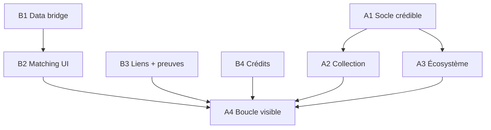

# Brainstorm — Plan UX/UI « Vivacité & crédibilité produit »

> **Statut : DRAFT (brainstorm)** — 2026-05-28. Synthèse recherche web (TCG, gamification SaaS, rétro-futurisme, empty states, View Transitions, Duolingo/Pokémon TCG Pocket) croisée avec le codebase et [draft-charte-graphique.md](../draft-charte-graphique.md). Promouvoir vers `docs/plans/` quand tranché.
>
> Voir aussi : plan technique jumeau [p3-socle-jeu-technique.md](p3-socle-jeu-technique.md) · [p1-5-productization-transition.md](../plans/p1-5-productization-transition.md).

---

## Ce que l'on sait

- **Objectif** : faire sentir un TCG d’autorité SEO (émotion, collection, progression) tout en restant **honnête** tant que la boucle crédits/liens n’est pas live (`GAME_LOOP_ENABLED=false`).
- **ADN visuel** : hub sombre sobre, cartes = seule couleur ; rareté Game Boy → Holo ([draft-charte-graphique.md](../draft-charte-graphique.md) §1–§3).
- **Tranche live** : `/capturer` (capture → carte). **Masqué** : économie fixtures (Donner, suggestions IA fictives).
- **Assets R&D réutilisables** : `WaxSealTransition`, `CreditRain`, `CardFlight` — à activer uniquement sur événements réels P3.
- **Stack UI** : CSS Modules + `tokens.css` + `motion` ; pas de Tailwind.

---

## Principes directeurs (non négociables)

| Règle | Implémentation |
|--------|----------------|
| Pas de fausses données | Garder `GAME_LOOP_ENABLED=false` jusqu’au câblage ledger/matching réel |
| 2/3 instruction, 1/3 délice | Empty states, capture : clarté d’abord (NN/g, UserOnboard) |
| Célébrer les jalons, pas chaque clic | Révélation N4 ≠ animation N1 (N3TWORK, Duolingo) |
| Feedback &lt; 100 ms | Nav, flip carte, validation URL |
| Une animation forte par écran | Éviter le micro-bruit sur les 5 routes produit |
| Mobile-first, bureau = console | Rail + canvas (`AppShell`, cf. P1.5) |
| `prefers-reduced-motion` | Déjà sur cartes — étendre hub, confettis, son |

---

## Phase A1 — Socle crédible (sans boucle de jeu)

*Durée indicative : 2–3 semaines. Dépendances : aucune P3 ; aligné [p1-5-productization-transition.md](../plans/p1-5-productization-transition.md) §5–§8.*

### Livrables

| # | Livrable | Détail | Fichiers / zones |
|---|----------|--------|------------------|
| A1.1 | Onboarding 0-carte | Hub : What / Why / Next → CTA « Capturer mon premier site » | `HubDashboard.tsx` |
| A1.2 | Capture « vivante » | Skeleton carte 320×540 + shimmer ; étapes « Capture → Analyse → Score » ; barres de signaux animées | `CaptureClient.tsx`, CSS |
| A1.3 | Révélation par niveau | Post-capture : N1 rapide / N3 bloom / N4 foil + **Skip** | Nouveau composant + `motion` |
| A1.4 | Badge NEW | Carte &lt; 24 h dans la main | `MiniCard.tsx`, mapper `createdAt` |
| A1.5 | Micro-feedback global | Nav active (glow + scale), boutons &lt; 100 ms | `AppNav`, `primitives.tsx` |
| A1.6 | Atmosphère console | Fond : gradient + scanlines très légers (hub) | `globals.css`, `tokens.css` |
| A1.7 | Empty states harmonisés | Écosystème vide, ComingSoon cohérent + CTA capture | `EcosystemeMap`, `ComingSoon.tsx` |

### Critères d'acceptation

- [ ] Compte neuf : en &lt; 10 s, comprend quoi faire sans 47 crédits ni « Marie L. »
- [ ] Capture : progression visible pendant Firecrawl (pas spinner seul)
- [ ] Révélation différenciée N1 vs N4 ; skip disponible
- [ ] Contrastes CTA néon sur fond sombre OK (a11y)

### Hors scope A1

Crédits animés, stepper Donner complet, feed social réel.

---

## Phase A2 — Collection & carte héros

*Durée indicative : 2 semaines.*

| # | Livrable | Détail |
|---|----------|--------|
| A2.1 | Main en grille (desktop) | Deck `auto-fill` ; tilt conservé |
| A2.2 | Transition liste → détail | View Transitions API ou FLIP `motion` : mini-carte → `<Card/>` |
| A2.3 | Fiche carte | Stats, signaux `AuthoritySnapshot`, historique captures |
| A2.4 | Album / filtres | Par `thematique`, `level` |
| A2.5 | États carte vivants | Overlays `en-echange` / `acquise` (pulse, `STATE_LABEL`) |

### Critères d'acceptation

- [ ] Desktop : main utilise la largeur ; mobile : scroll ou grille 2 col
- [ ] Ouverture carte : continuité visuelle (shared element)

---

## Phase A3 — Écosystème « carte du monde »

*Durée indicative : 2–3 semaines. Données : `getNavDeck()` réel.*

| # | Livrable | Détail |
|---|----------|--------|
| A3.1 | Pan/zoom map | Pinch + drag ; safe-area |
| A3.2 | Biomes + brouillard | Zones vides atténuées ; labels au zoom |
| A3.3 | Nœud vivant | Pulse sur sélection |
| A3.4 | Drawer partenaire | Mini-carte + CTA Donner (disabled si `!GAME_LOOP`) |
| A3.5 | Chemins (visuel) | Flèches unidirectionnelles (préparation P3) |
| A3.6 | Minimap (opt.) | Coin bas-droite desktop |

### Critères d'acceptation

- [ ] Map utilisable au doigt 390×844
- [ ] Pas de CTA trompeur si boucle fermée

---

## Phase A4 — Boucle de jeu visible

*Durée indicative : 3–4 semaines. **Dépend de** [p3-socle-jeu-technique.md](p3-socle-jeu-technique.md) B3+ et `GAME_LOOP_ENABLED=true`.*

| # | Livrable | Détail |
|---|----------|--------|
| A4.1 | Crédits vivants | Odometer sur gain ; `getMe` = SUM ledger |
| A4.2 | Flux Donner (4 étapes) | Stepper ; Fit IA ; ancre éditable surlignée |
| A4.3 | Découvrir | Slider budget ; bandeau « aucune garantie » renforcé |
| A4.4 | Preuves | Scan + ancre highlight ; timeline |
| A4.5 | Transitions signature | `WaxSeal` / `CreditRain` sur événements réels |
| A4.6 | Jalons streak | Célébrations 7/30/100 jours seulement |
| A4.7 | Share card | Export « don éditorial vérifié » (pas DA boost) |

### Critères d'acceptation

- [ ] Rappel permanent : IA propose, humain valide, pas de publication auto
- [ ] Célébrations longues skippables

---

## Phase A5 — Polish multisensoriel (optionnel)

*Durée indicative : 1–2 semaines.*

| # | Livrable | Détail |
|---|----------|--------|
| A5.1 | Sons synthétiques | Web Audio par niveau ; opt-in ; thème `crisp` hub |
| A5.2 | Haptique PWA | Patterns courts Android ; toggle settings |
| A5.3 | Quotas d'ancre visuels | BRANDED/GENERIC… sur lot de suggestions (étape 3 Donner) |

---

## Dépendances Plan A ↔ Plan B

---

## Idées « coup de cœur » (alignement produit)

| Idée | Pourquoi |
|------|----------|
| Révélation de niveau post-capture | Lie SEO → émotion TCG immédiatement |
| Morph hub → détail carte (View Transitions) | Collection physique |
| Chemins unidirectionnels animés sur la map | Incarne donor ≠ réciproque |
| Signaux d'autorité qui se remplissent | Transparence + spectacle |
| Sceau de cire sur preuve validée | Signature produit (déjà R&D) |
| Album par biome + cartes DB réelles | Joie sans fixtures |
| Sons par ère (GB/SNES/PS2/Holo) | Matrice du temps (charte §4) |

---

## Métriques UX (à instrumenter)

- Taux activation : 1ère capture &lt; 24 h post-login
- Abandon pendant étape Firecrawl
- % skip révélation N4
- (P3) Complétion Donner étape 3 → validation humaine

---

## Références web (recherche 2026-05-28)

- [Card game UI/UX](https://www.gunslingersnft.com/post/card-game-ui-ux-design-elevating-player-experience)
- [Choreographed card reveal (N3TWORK)](https://medium.com/n3twork/choreographed-emotion-6-steps-to-a-great-card-reveal-ux-a6e6bb8487dd)
- [Pokémon TCG Pocket — collection & ouverture](https://gfrfund.com/blog/pokemon-tcg-pockets)
- [Micro-interactions 2026](https://dev.to/devin-rosario/5-micro-interaction-design-rules-for-apps-in-2026-48nb)
- [Empty states SaaS](https://www.saasfactor.co/blogs/empty-state-ux-turn-blank-screens-into-higher-activation-and-saas-revenue)
- [Skeleton screens (NN/g)](https://www.nngroup.com/articles/skeleton-screens/)
- [View Transitions (Chrome)](https://developer.chrome.com/docs/web-platform/view-transitions)
- [Duolingo streak milestones](https://blog.duolingo.com/streak-milestone-design-animation/)
- [Retro-futurism UX (LogRocket)](https://blog.logrocket.com/ux-design/retro-futuristic-ux-designs-bringing-back-the-future/)

---

## Questions en cours

- [ ] **UX-D1** : Détail carte — drawer vs page dédiée ?
- [ ] **UX-D2** : Son opt-in — défaut off ou on ?
- [ ] **UX-D3** : Promouvoir ce plan vers `docs/plans/` après validation sprint S1 ?
